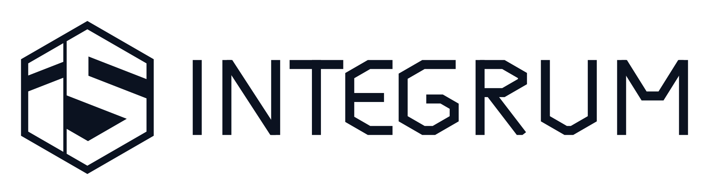

# .github

Organization profile and brand assets for Integrum Systems.

`profile/README.md` is what renders on the organization page.

## Assets

Everything in `assets/` is generated. Edit the scripts, never the SVGs.

| Prefix | What |
|---|---|
| `integrumsys-mark` | The IS hexagon mark on its own |
| `integrumsys-wordmark` | INTEGRUM |
| `integrumsys-lockup` | Mark and wordmark, horizontal |
| `integrumsys-lockup-stacked` | Mark above wordmark and SYSTEMS |
| `integrumsys-lockup-descriptor` | Horizontal, with the SYSTEMS descriptor |

Each comes in four colourways: no suffix is Ink `#0B1220` on a transparent
ground, `-inverse` is white on transparent, `-on-white` and `-on-black` add a
plate. PNG copies exist where they are useful: the mark at 512 and 1024 for
avatars, the two lockups at 1200 and 2400 for slides and signatures.

Use the transparent SVG by default, and `-inverse` for dark backgrounds:

```html
<picture>
  <source media="(prefers-color-scheme: dark)" srcset="assets/integrumsys-lockup-inverse.svg">
  
</picture>
```

Reference these from other repositories by **tag**, not by `main`, so a future
change to the artwork does not silently alter them.

## Regenerating

```sh
python3 scripts/integrum_is_svg.py      # the mark
python3 scripts/integrum_wordmark.py    # wordmark and lockups
python3 scripts/qa_wordmark.py          # measurements on the letterforms
```

The two generators need only the standard library, plus `rsvg-convert` for the
PNG exports, which they skip with a warning if it is missing. `qa_wordmark.py`
additionally needs numpy and Pillow.

It checks the things that are easy to break and hard to see: that no letter has
come apart, that every letter reaches the cap line, that the white area between
neighbours stays even, that every corner cut holds 30 degrees, and that
counters stay open down to 110px. Run it after touching `integrum_wordmark.py`.
